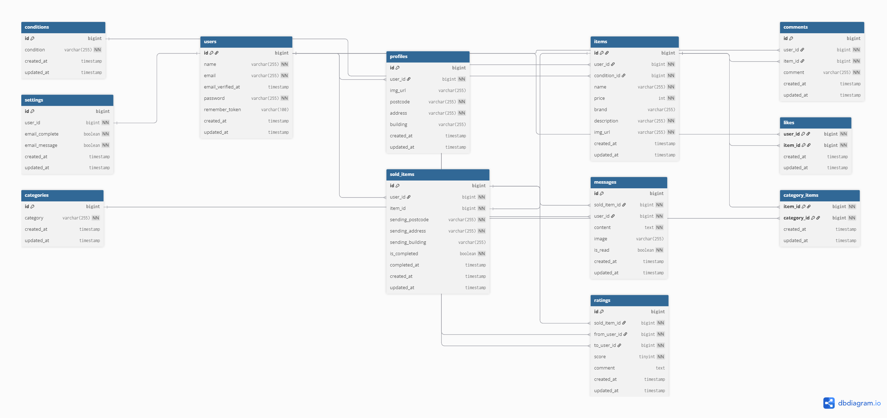

# furima(フリマアプリ)

## 概要
本プロジェクトは、ユーザーが商品を売買できるフリマアプリです。  
出品機能、購入機能、お気に入り機能、コメント機能などを備えています。

## 環境構築
**Dockerビルド**
1. `https://github.com/tominaga-rikiya/furimaPro.git`
2. DockerDesktopアプリを立ち上げる
3. `docker-compose up -d --build`

> *MacのM1・M2チップのPCの場合、`no matching manifest for linux/arm64/v8 in the manifest list entries`のメッセージが表示されビルドができないことがあります。
エラーが発生する場合は、docker-compose.ymlファイルの「mysql」内に「platform」の項目を追加で記載してください*
``` bash
mysql:
    platform: linux/x86_64(この文追加)
    image: mysql:8.0.26
    environment:
```

**Laravel環境構築**
1. `docker-compose exec php bash`
2. `composer install`
3. 「.env.example」ファイルを 「.env」ファイルに命名を変更。または、新しく.envファイルを作成
4. .envに以下の環境変数を追加
``` text
DB_CONNECTION=mysql
DB_HOST=mysql
DB_PORT=3306
DB_DATABASE=laravel_db
DB_USERNAME=laravel_user
DB_PASSWORD=laravel_pass
```
5. アプリケーションキーの作成
``` bash
php artisan key:generate
```

6. マイグレーションの実行
``` bash
php artisan migrate
```

7. シーディングの実行
``` bash
php artisan db:seed
```

8. シンボリックリンク実行
``` bash
php artisan storage:link
```

9. Laravel Mix（JS・CSSビルド）のセットアップ(srcのディレクトリで)
``` bash
npm install
npm run dev
```

*http://localhostで権限によるエラーが発生する場合はstorage/logs/laravel.logの権限を変更*
``` bash
chmod -R 777 storage
chown -R www-data:www-data storage  # WSL なら「www-data」ではなく「$USER」でもOK
```

*5.6と続けた場合エラーが出たら、もう一度サービスを再起動*
``` bash
docker-compose down
docker-compose up -d
```

## 使用技術(実行環境)
- PHP8.3.0
- Laravel8.83.27
- MySQL8.0.26
- Node.js: v18.20.8
- npm: 10.8.2

## URL
- 開発環境：http://localhost/
- phpMyAdmin:：http://localhost:8080/
- Stripe:https://docs.stripe.com/payments/checkout?locale=ja-JP

## メール認証
mailtrapというツールを使用しています。<br>
以下のリンクから会員登録をしてください。　<br>
https://mailtrap.io/

左側のサイドバーのsandboxesを押す
メールボックスのIntegrationsからphpの「laravel 7.x and 8.x」を選択し、　<br>
.envファイルのMAIL_MAILERからMAIL_ENCRYPTIONまでの項目をコピー＆ペーストしてください。　<br>　

## Stripeについて
コンビニ支払いとカード支払いのオプションがありますが、決済画面にてコンビニ支払いを選択しますと、レシートを印刷する画面に遷移します。そのため、カード支払いを成功させた場合に意図する画面遷移が行える想定です。<br>

また、StripeのAPIキーは以下のように設定をお願いいたします。
```
STRIPE_PUBLIC_KEY="パブリックキー"
STRIPE_SECRET_KEY="シークレットキー"
```

## テストアカウント
name: 一般ユーザ1 
email: general1@gmail.com  
password: password  
-------------------------
name: 一般ユーザ2 
email: general2@gmail.com  
password: password  
-------------------------
name: 一般ユーザ3(紐づけなし)
email: general3@gmail.com  
password: password  
-------------------------

## ER図
