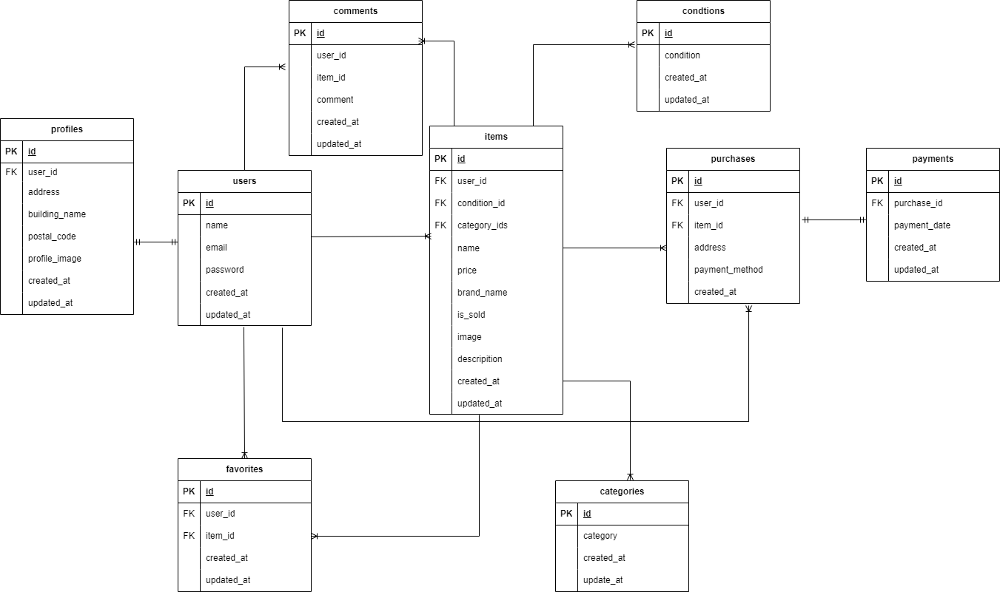

# furima(フリマアプリ)

## 概要
本プロジェクトは、ユーザーが商品を売買できるフリマアプリです。  
出品機能、購入機能、お気に入り機能、コメント機能などを備えています。

## 環境構築
**Dockerビルド**
1. `git clone git@github.com:tominaga-rikiya/furima.git`
2. DockerDesktopアプリを立ち上げる
3. `docker-compose up -d --build`

> *MacのM1・M2チップのPCの場合、`no matching manifest for linux/arm64/v8 in the manifest list entries`のメッセージが表示されビルドができないことがあります。
エラーが発生する場合は、docker-compose.ymlファイルの「mysql」内に「platform」の項目を追加で記載してください*
``` bash
mysql:
    platform: linux/x86_64(この文追加)
    image: mysql:8.0.26
    environment:
```

**Laravel環境構築**
1. `docker-compose exec php bash`
2. `composer install`
3. 「.env.example」ファイルを 「.env」ファイルに命名を変更。または、新しく.envファイルを作成
4. .envに以下の環境変数を追加
``` text
DB_CONNECTION=mysql
DB_HOST=mysql
DB_PORT=3306
DB_DATABASE=laravel_db
DB_USERNAME=laravel_user
DB_PASSWORD=laravel_pass
```
5. アプリケーションキーの作成
``` bash
php artisan key:generate
```

6. マイグレーションの実行
``` bash
php artisan migrate
```

7. シーディングの実行
``` bash
php artisan db:seed
```

## ログイン情報
### 管理者ユーザー
- メールアドレス: testuser1@example.com
- パスワード: password123456

### 一般ユーザー
- メールアドレス: testuser1@example.com
- パスワード: password123456


8. シンボリックリンク実行
``` bash
php artisan storage:link
```

*http://localhostで権限によるエラーが発生する場合はstorage/logs/laravel.logの権限を変更*
``` bash
chmod -R 777 storage
chown -R www-data:www-data storage  # WSL なら「www-data」ではなく「$USER」でもOK
```

## 使用技術(実行環境)
- PHP8.3.0
- Laravel8.83.27
- MySQL8.0.26

## ER図


## URL
- 開発環境：http://localhost/
- phpMyAdmin:：http://localhost:8080/
